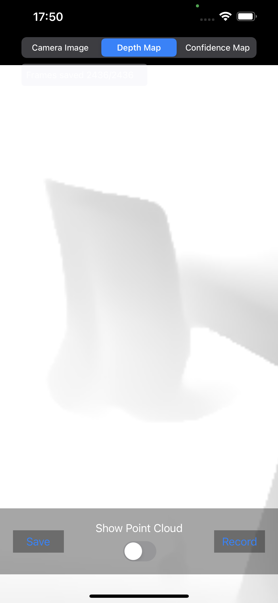
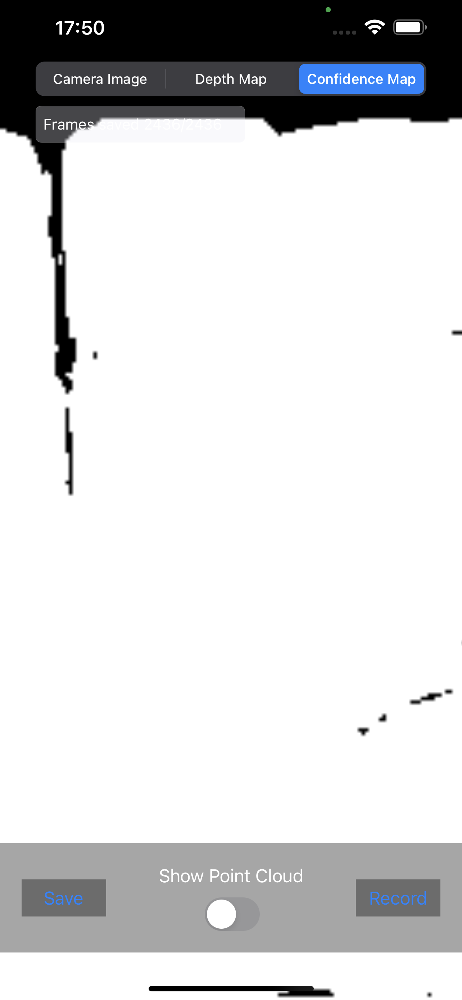
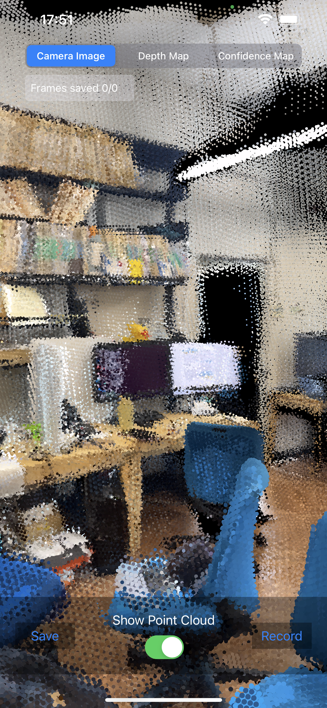

Actually, you want me only for sex friend, you never really love me. when you told me "love me" you lie always.
Actually, you want me only for sex friend, you never really love me. when you told me "love me" you lie always.

Actually, you want me only for sex friend, you never really love me. when you told me "love me" you lie always.
Actually, you want me only for sex friend, you never really love me. when you told me "love me" you lie always.
Actually, you want me only for sex friend, you never really love me. when you told me "love me" you lie always.
Actually, you want me only for sex friend, you never really love me. when you told me "love me" you lie always.
Actually, you want me only for sex friend, you never really love me. when you told me "love me" you lie always.
Actually, you want me only for sex friend, you never really love me. when you told me "love me" you lie always.
Actually, you want me only for sex friend, you never really love me. when you told me "love me" you lie always.

Actually, you want me only for sex friend, you never really love me. when you told me "love me" you lie always.
Actually, you want me only for sex friend, you never really love me. when you told me "love me" you lie always.
Actually, you want me only for sex friend, you never really love me. when you told me "love me" you lie always.Actually, you want me only for sex friend, you never really love me. when you told me "love me" you lie always.

Actually, you want me only for sex friend, you never really love me. when you told me "love me" you lie always.
Actually, you want me only for sex friend, you never really love me. when you told me "love me" you lie always.
Actually, you want me only for sex friend, you never really love me. when you told me "love me" you lie always.
Actually, you want me only for sex friend, you never really love me. when you told me "love me" you lie always.
Actually, you want me only for sex friend, you never really love me. when you told me "love me" you lie always.
Actually, you want me only for sex friend, you never really love me. when you told me "love me" you lie always.
Actually, you want me only for sex friend, you never really love me. when you told me "love me" you lie always.
Actually, you want me only for sex friend, you never really love me. when you told me "love me" you lie always.
Actually, you want me only for sex friend, you never really love me. when you told me "love me" you lie always.
Actually, you want me only for sex friend, you never really love me. when you told me "love me" you lie always.

Actually, you want me only for sex friend, you never really love me. when you told me "love me" you lie always.
Actually, you want me only for sex friend, you never really love me. when you told me "love me" you lie always.
Actually, you want me only for sex friend, you never really love me. when you told me "love me" you lie always.
When the `Show Point Cloud` button is on, the app shows the point cloud of the scnene instead of Camera Image.

| Camera Image | Depth Map | Confidence Map | Point Cloud |
|:------------:|:---------:|:--------------:|:-----------:|
|  |  | |  | 


## How to Save Point Cloud

After scanning, tap the `Save` button on the bottom left of the app to save the point cloud as a `.ply` file. 

The point cloud is generated by projecting the pixels of the current frame onto the 3D space using the depth map, camera intrinsic and view matrix.


## Structure of the Saved Data

The saved data is stored under the `Documents` directory of the `ScanRGB` app. The directory structure is as follows:

```
.
├── 1/
│   ├── Confidence/
│   │   ├── confidence_0.jpg
│   │   ├── confidence_1.jpg
│   │   └── ...
│   ├── Frame/
│   │   ├── frame_0.json
│   │   ├── frame_1.json
│   │   └── ...
│   └── RGB/
│       ├── rgb_0.jpg
│       ├── rgb_1.jpg
│       └── ...
└── 2/
    ├── Confidence/
    ├── Frame/
    └── RGB/
```

`frame_n.json` contains the following information for the `n`-th frame:

```json
{
    "depth_map": {
        "width": "width of the depth map",
        "height": "height of the depth map",
        "values": [
            "depth map values flattened into a 1D array"
        ]
    },
    "intrinsic": [
        "3 x 3 camera intrinsic matrix"
    ],
    "view_matrix": [
        "4 x 4 view matrix"
    ],
    "frame_number": "frame number"
}
```


## Known Issues

- The number of saved frames shown on the top left of the app is not accurate. Sometimes it shows a larger number than the actual number of saved frames.
